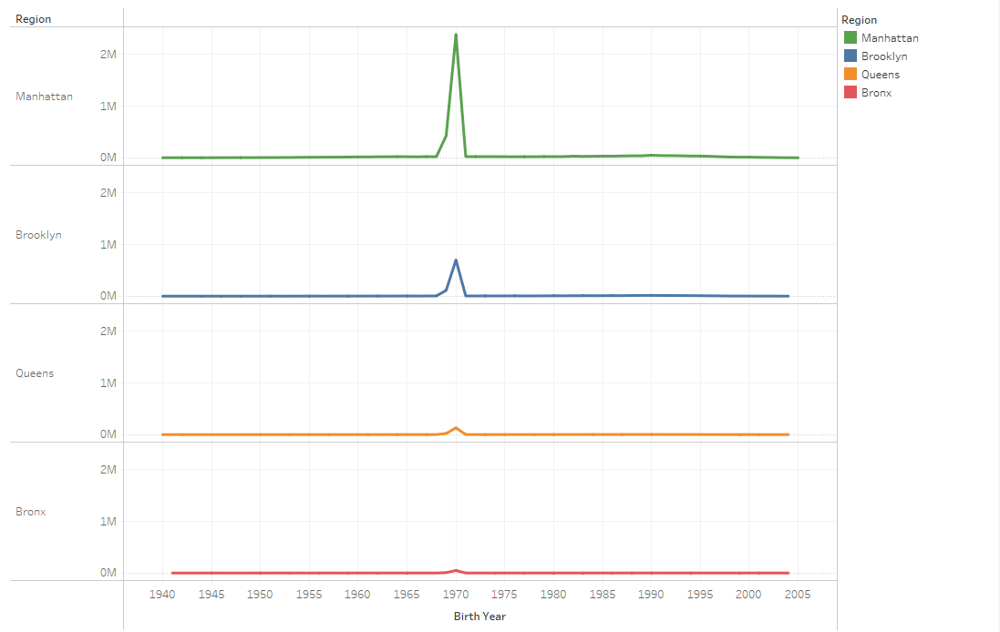
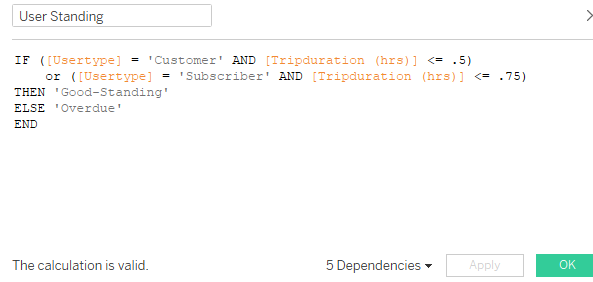
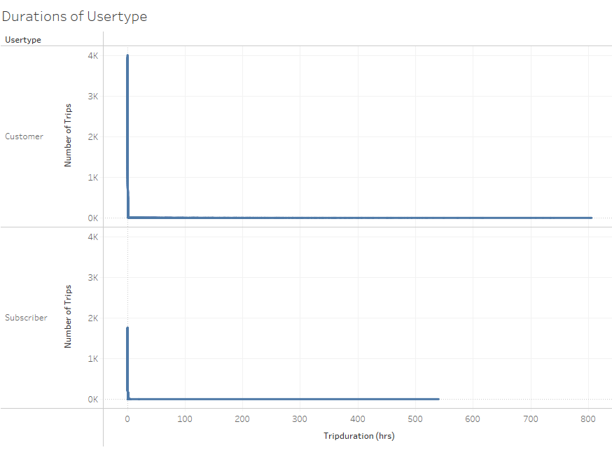

# tableau-challenge

## Introduction

The purpose of this report is to visualize historic rental bike data in New York City in order to search for trends that can lead to actionable insights. In a large city such as New York a diverse array of transportation options will always be necessary to serve the population and keep traffic congestion to a minimum. Bike rentals are one option of many and should be encouraged because of the availability of bike lanes and the benefit of being an environmentally friendly selection.

For the purposes of this assignment, I chose to complete two tasks:
- Break down the distribution of ages by region of the New York City area.
- Show the percentage of users returned the bikes within the time restriction set by CitiBike's service.

Full CitiBike Story can be found at https://public.tableau.com/app/profile/josh.sniderman/viz/CitiBike_Analysis_16219772087340/CitiBikeStory

## Data Preparation

Before we can begin preparing visuals, we must fix the data to make our tasks possible.

Using the map visual and the lasso tool, grouped locations by regions : Manhattan, Brooklyn, Queens, and the Bronx.

Data shown can be isolate by region.

Prediction 1: Ages in regions, mostly peak near millennial birth years.
Set up Count of Trips by Birth Year

Anomaly 1: Large spike at 1969 – 1970
Assumption is default birthyear, lack of null values
Birth year (around spike) group created, show with Total Count

Distribution by Age created to show how extreme the spike is

Concluded it is difficult to determine which 1969-1970 datapoints are genuine, so all visuals using age will exclude birthyears 1969 and 1970.
Count of Trips by birth year viz duplicated, this time with birthyear (around spike) filter created

As predicted, majority of birthyears in millennial birthyears, with peaks at 1990 for Manhattan, Brooklyn, and Queens, and peak at 1988 for the Bronx.

Birthyear Dash
Birthyear dash 1

Data can be isolated by region for more detailed analysis.

Prediction 2: Majority of trips will be within the allowed duration established by CitiBkie’s service.
According to citibikenyc.com, Day Passes are restricted to 30-minute trips, and annual subscriptions are restricted to 45-minute trips
For this reason, the User Standing Calculated Field has been created 

Using user standing, line graph Durations of Usertype created

Anomaly 2: Data with extreme time durations, some as high as over 800 hours
Assumed to be Bikes either used for extreme periods of time, or bikes were stolen

To figure the importance of extreme time durations on overall analysis, Parameter AB and Group Above/Below have been created, to create graph Are Durations Over 1 Hour Worth putting on visualization

Data points over 1 hour are so insignificant, the are not necessary to put onto the visual. Therefore, will be excluded for easier readability on User Standing by Usertype

As we see on the dashboard, large humps in good standing data, with significant declines before becoming overdue, proving our prediction.

Over 98% Subscribers good standing, but only 88% of customers, most likely tourists, which makes sense.

Visual can be isolated by usertype and userstanding cross:

One interesting point: if isolating users from the 1969-1970 spike from the previous exercise, almost exclusively Customers

Taking what we concluded from the previous section about 1970 being essentially a null value, this would make sense, as Subscribers are more likely to fill in personal information, whereas one-time customers will certainly skip out on filling out forms.

