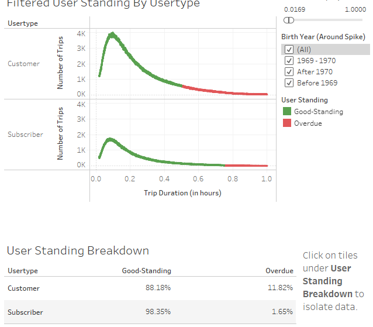

# tableau-challenge

## Introduction

The purpose of this report is to visualize historic rental bike data in New York City in order to search for trends that can lead to actionable insights. In a large city such as New York a diverse array of transportation options will always be necessary to serve the population and keep traffic congestion to a minimum. Bike rentals are one option of many and should be encouraged because of the availability of bike lanes and the benefit of being an environmentally friendly selection.

For the purposes of this assignment, I chose to complete two tasks:
- Break down the distribution of ages by region of the New York City area.
- Show the percentage of users returned the bikes within the time restriction set by CitiBike's service.

Full CitiBike Story can be found at https://public.tableau.com/app/profile/josh.sniderman/viz/CitiBike_Analysis_16219772087340/CitiBikeStory

## Data Preparation

Datasets used includes data for rentals from January, Feburary, March, and April of 2021 (four months of data).

Before we can begin preparing visuals, we must fix the data to make our tasks possible. Using the map visual and the lasso tool, we can group the locations into four regions : Manhattan, Brooklyn, Queens, and the Bronx. 

-----

## Prediction 1: 
### Ages in each regions will peak near millennial birth years (1985 - 1994).

We believe that most rental bike users in the New York City area will be millenials, being born in and around years 1985 to 1994.

To see the distribution of ages in the regions, we have created a dashboard:

-----

As we can see from this visualization, we have found our ***first anomaly***, a large spike of data entries in the years 1969 and 1970. As we see on the dashboard, 72.93% of all data points fall within these two years. Since it would be unrealistic that this many people would be born in a single year, we must make another assumption as to why there are so many data entries for this birthyear.

When we look at the data, we see that there are no ***null*** values. Knowing that it is unlikely that every single user has chosen to enter their birthyear for use of the service, we can assume that the users who chose not to give CitiBike their personal information simply left this field on the default value, which must have been 1970. It is much more likely that 72.93% of users simply did wish to fill in this information, than 72.93% of users be born in a single year.

Unfortunately, there is not an easy way to determine which users were actually born in 1970, and which were only default valued entries. For this reason, for the purposes of our analysis, we must exclude all values from the birthyears 1969 and 1970 to see a more accurate look of age distribution. 

The folowing dashboard uses data excluding birthyears 1969 and 1970. We can clearly see the gap in the lower left visual, but it is safe to assume a straight line connecting the data around the gap:

-----

As predicted, majority of birthyears in millennial birthyears, with 36.94% of datapoints falling within the bounds of 1985 to 1994, with peaks at 1990 for Manhattan, Brooklyn, and Queens, and peak at 1988 for the Bronx. An overall peak at 1990 can be seen below when isolated:

-----

## Prediction 2: 
### Most rentals will be returned within the allowed time established by CitiBkie’s service.

According to citibikenyc.com, Day Passes are restricted to 30-minute trips, and annual subscriptions are restricted to 45-minute trips. We believe that the vast majority of users, both customers AND subscribers, will follow these rules established and return our bikes with the time limit established by CitiBike.

To visualize this data, we will show the distribution of of trips falling within a time duration and color code user standing, with green data being bikes being returned within the allotted timeframe, and red being biks which were kept for longer than allowed. 

-----

Using all of the data, we have created a visual which is largely unhelpful. Most data is squished to the left side of the graph because of the unusually large Trip Duration values present in the data. Here we find our ***second anomaly*** in the data: entries with extreme time durations, some as high as over 800 hours. That's over 33 days!

Given the nature of our business, it would be safe to assume that some bikes may be kept for periods much longer than allowed, and to assume some bike will be stolen. These bikes will allot for such extreme duration values. For this reason, it would be smart for us to limit the trip durations to values that make a more useful visual.

As we see in the lower visual above, less than 2% of all trips are greater than 1 hour. For this reason, we can limit the visuals to as short as 1 hour and still produce something quite significant to the question we are trying to answer, as we do in ther following dashboard:

-----

That is much easier to read! As we see on the upper visualization, a large portion of the trips are in Good Standing, forming large humps around .15 hours (about 10 - 12 minutes), with significant declines before becoming overdue. The lower visual of the dashboard is a breakdown of User Standing and is not retricted to 1 hour, but rather contains all datapoints, including extreme values.

As is shown under User Standing Breakdown, over 98% Subscribers good standing, which is what we would expect for regular users. However, only 88% of customers are in good standing, which, although is still quite good, still leads to overdue bikes to be in the double digits. This is understandable, though, as daily users are more likely to be tourists or other non-regular users, whom may have a trickier time finding return stations to return the bikes or understanding the restictions of the service.

One interesting point we found on this dashboard: if we isolate users from the 1969-1970 spike in birthyears we found in the previous exercise, we find that the spike is almost exclusively Customers contributing.

-----

Taking what we concluded from the previous section about 1970 being essentially a null value, this would make sense, as Subscribers are more likely to fill in personal information, whereas one-time customers will certainly skip out on filling out forms.

## What Can We Improve?

Given what we have found over the course of this presentation, we have two reccomendations for how to improve user experience and to help clean the incoming data for further analysis:

### Create an option for user to not enter a birthyear.

Not only will this make it easier for your data analysts to know which users are actually born in 1970 and thus easier to analyze the data, but it will also give your users a greater sense of privacy to know that they are not required for fill in invasive forms just to use the service. 

### Make it easier for non-regular users (i.e. 'Customers') to understand the service.

As we saw, we are doing wonderfully with Subscribers returning bikes within their 45 minute timeframe. However, for one-time non-regular customers, the service can certainly be improved. This can mean establishing more or more obvious drop-off locations for returning bikes, making the time allowance clearer to newer customers, and simplifying forms to fill before being able to user the service. 
